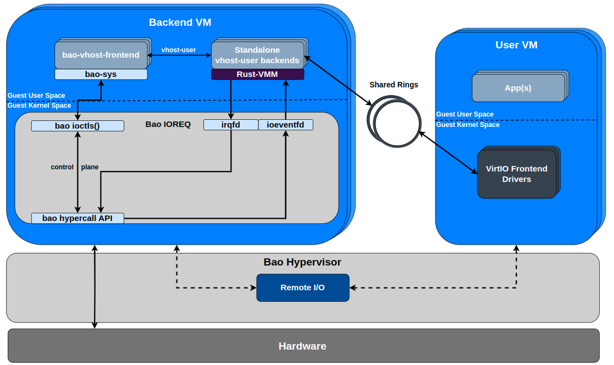

# bao-vhost-frontend

The bao-vhost-frontend crate furnishes an infrastructure capable of implementing the frontend/master side of the vhost-user protocol. This implementation is designed to be compatible with the Bao hypervisor and allows the verification of the hypervisor-agnostic nature of Rust-based vhost-user backends.

**Note**: The crate has been relocated to the workspace [bao-virtio](https://github.com/joaopeixoto13/bao-virtio). This move was made to accommodate Bao's expanded support for common VirtIO, as well as Vhost and Vhost-user devices.

### Architecture

    

